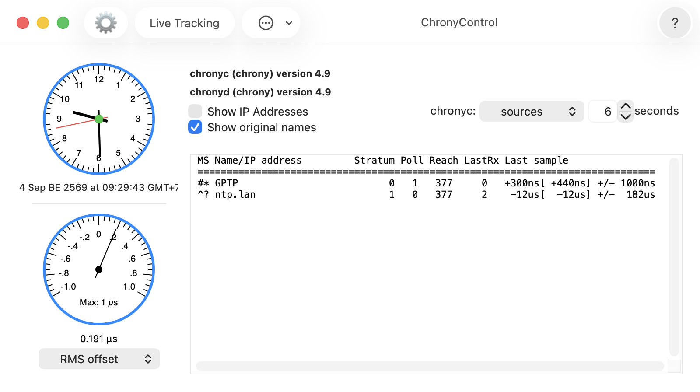

# mac-gptp

macOS includes a complete IEEE 802.1AS (gPTP) implementation in the kernel.
AVB audio and AirPlay use this implementation.
When a Mac with an AVB-capable Ethernet adapter is connected to a gPTP grandmaster, the kernel maintains a virtual clock synchronized to the grandmaster's time.
gPTP does not synchronize the Mac's system clock.
Apple exposes the gPTP clock through TimeSync, a private framework with no public documentation.
This repository contains a C library for using TimeSync and two programs built on the library.
`gptp-refclock` uses the gPTP clock to provide timing information to chrony.

## Hardware requirements

On the Mac, the Ethernet interface must support AVB, since macOS enables gPTP only on an AVB interface.
`system_profiler SPEthernetDataType` reports `AVB Support: Yes` for a suitable interface.
The built-in Ethernet port on a desktop Mac is the simplest way to get this support.
A Mac without a suitable built-in port needs a real Thunderbolt Ethernet adapter; an ordinary USB-C Ethernet adapter will not work.
The cheapest Thunderbolt option is usually a used Apple Thunderbolt to Gigabit Ethernet Adapter connected through an Apple Thunderbolt 3 (USB-C) to Thunderbolt 2 Adapter.
This is the combination used for the tests here.

The PTP grandmaster must speak the IEEE 802.1AS profile.
A suitable Linux grandmaster can use a GPS module and [SatPulse](https://satpulse.net/) to synchronize an Ethernet port's PTP hardware clock.
`ptp4l` from [linuxptp](https://www.linuxptp.org/) serves time from that clock.
Configure `ptp4l` with the supplied `gPTP.cfg` so that it uses the 802.1AS profile required by the Mac.

Separately, each link on the path between the grandmaster and the Mac must pass the 802.1AS peer-delay check.
The TimeSync port used here reports a fixed upper limit of 1000 ns and does not become `asCapable` when the measured delay exceeds it.
The Mac can connect directly to the grandmaster, or the path can use an AVB switch or another switch with explicit 802.1AS support.
I have not tested either kind of switch.
AVB switches are a purpose-built but expensive option.
An ordinary Ethernet switch will not work because it does not participate in the peer-delay exchange.

The tested general-purpose alternative uses a multiport Linux mini-PC running `ptp4l` as a boundary clock, with direct cables from the boundary clock to the grandmaster and the Mac.
Good performance from this arrangement requires PTP hardware timestamping on each port and working [PCIe Precision Time Measurement (PTM)](https://satpulse.net/hardware/ptm.html), so that Linux can cross-timestamp each port's PTP hardware clock against the system clock accurately.
Run `phc_ctl eth1` and check that it reports `has cross timestamping support` to verify that PTM is working for a port.
PTM does not work on processors before Intel's 12th generation.
For a mini-PC, an N5105 or later processor with Intel I226 ports is a good rule of thumb.
The [test setup](docs/test-setup.md) describes the working N5105 boundary clock and the complete three-machine configuration.

## What it gives

The accuracy of the virtual clock depends on the setup.
My test used a Linux boundary clock with a direct gigabit link to the Mac and a direct 2.5-gigabit link to the grandmaster.
The grandmaster's port clock was held within 10 ns of GPS-derived time.
Samples of the mapping taken a few seconds apart agreed to about 250 ns.
A GPS pulse checked against the mapping stayed steady within the few microseconds that the checking method can resolve.
I would trust the mapping to about a microsecond in absolute terms.
The remaining uncertainty is a fixed offset in the adapter-to-mach cross-timestamp that cannot be measured on the Mac.

With chrony steering the system clock from the refclock in this repository, the system clock tracked the grandmaster with a residual of 0.6 us RMS.
The limiting factor is the Mac's oscillator, which wanders by several hundred ppb over a few minutes, rather than the link.
The runs are described in [gptp-refclock](docs/gptp-refclock.md).

## The library

`libgptp.a`, built from `gptp.h` and `gptp.m`, is a C interface to the Mac's gPTP clock.
A program can use it to add a gPTP port, read the state of the domain and its mapping, and convert any mach time to grandmaster time.
The [libgptp](docs/libgptp.md) page describes the interface.

## The programs

`gptp-refclock` is a chrony reference clock.
It compares the gPTP mapping with the system clock and sends the differences to chrony as complete SOCK samples.
chrony uses these samples to make the system clock follow the grandmaster.
With the chrony configuration given in [gptp-refclock](docs/gptp-refclock.md), the system clock tracked the grandmaster with a residual of 0.6 us RMS.

`gptp-pps-offset` uses the gPTP clock to measure the latency of detecting a GPS pulse by polling a serial port's CTS pin.
It prints the value to use for chrony's `offset` option on that refclock's line.
The [gptp-pps-offset](docs/gptp-pps-offset.md) page describes the measurement.

`tsdump` lists the methods of any class in the framework, with their type encodings.
It was used to discover the TimeSync interface and can show what changed if a future macOS release breaks the library.

## Building

    make
    sudo make install

`make` builds `libgptp.a`, the two programs and `tsdump`, linking only Foundation.
The library loads the private framework at run time.
`make install` puts the programs in `/usr/local/bin`, and the library and header in `/usr/local/lib` and `/usr/local/include`.
`gptp.m` is Objective-C and everything else is C.

## Caveats

The framework is private and undocumented.
Everything here was first verified on a single Mac mini M4 running macOS 15.7.7 with TimeSync 1340.13.
The refclock continues to work without code changes on the same Mac running macOS Tahoe 26.6.2 with TimeSync 1460.2.
If another macOS release renames a class or selector, the library fails at start-up and names the missing class or selector.
`tsdump` then shows what the class provides in that release.
The refclock has to run as root only because chrony creates its socket with permissions that allow only root to write to it.

## Documentation

The [documentation index](docs/README.md) covers the library, programs, private framework and test setup.
